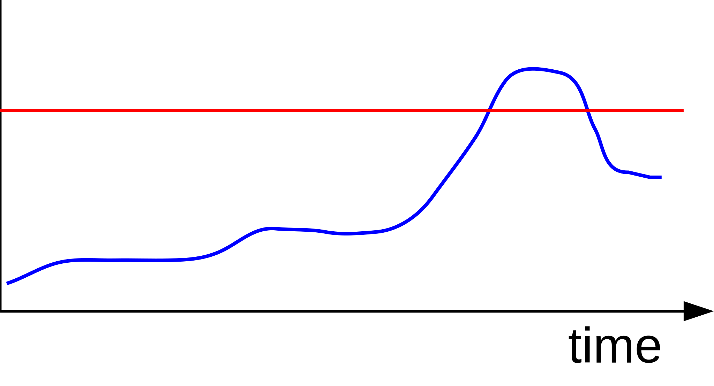

title: Prometheus
subtitle: Whitebox monitoring with metrics
class: animation-fade
layout: true

---
class: inverse, background-title

.dark-box[
# {{title}}
{{subtitle}}

Markus Benning

.created-on[2016-08-26]
]
---
class: inverse

.head[
  # Target
  ## Dynamic cloud environments
]
---
.head[
  # Blackbox vs. Whitebox Monitoring
]
.col-6[
### Blackbox

Observes the application from the outside.

Example:
* Retrieve application start page
  * Measure response time
  * Check status code
  * Search for watchdog
]
.col-6[
### Whitebox

Collects data provided by the application.

Example:
* Application provides internal statistics
 * Total number of requests
 * Number of requests by status code (2xx, 3xx, 4xx, 5xx)
 * Min/Avg/Max response time
 * Number of slow requests (>5sec)
]
---
.head[
  # Blackbox vs. Whitebox Monitoring
]
.col-6[
### Blackbox
* No support of the application needed
* Checks external functionality
* End to end tests
]
.col-6[
### Whitebox
* Provides internal metrics
* Can provide information about the whole system
* Can provide a lot of additional information
  * usefull for diagonstics, optimization and debugging
  * usefull for capacity planning
  * usefull for measuring changes
]
---
.head[
  # Check based vs. Metrics based Monitoring
]
.col-6[
### Check based
Executes check and returns success or failure.

* Decision is made by the check
* Threshold is configure in the check


]
.col-6[
### Metric based
Gathers metrics and stores them in time series.
Later an filter could be used to search for failures.

* Data is collected "as is"
* Threshold could be dynamicly applied by query/filter
* Could use aggregations and calculations


]
---
.head[
  # Data Model
  ## Hierarchical vs. Dimensional
]

.col-6[
### Hierarchic
Typical for check based systems:

* Checks grouped by host
* Host grouped by Environment, Service, Location, Network, ...

Metrics:
```
host123.apache.requests.code.500 = 54321
```
(eg. graphite)
]
.col-6[
### Dimensional
Prometheus:

```
http_requests_total{
  environment="integration",
  service="frontend",
  status="500",
  instance="host123"
} = 54321
```

Docker, Kubernetes, and many more do it this way.
]
---
class: inverse
.head[
  # Getting started
  ## A basic prometheus setup
]
---
background-image: url(architecture.svg)
background-size: 800px
.head[
  # Architecture Overview
]
---
.head[
  # Service Discovery
  ## Supported mechanisms
]
* DNS
* Consul
* AWS, GCE, Azure
* Openstack
* Kubernetes
* ...
* Config file
* External files (custom integrations)
---
.head[
  # Service Discovery
  ## Discovered target information
]

Structure of a discovered service (sd\_config):
```json
{
  "targets": [ "<host>", ... ],
  "labels": {
    "<labelname>": "<labelvalue>", ...
  }
}
```
Target:
```
<host> = <hostname|ip>[:<port>] # default port 9100
```
The labels `job` and `instance` are always set.
---
.head[
  # Data generation
  ## Metric Endpoints
]

* A metric endpoint is a **http server**
* The default location is **/metrics**
* Document in **Prometheus exposition format** (text/binary)

.col-6[
**Exporters** provide metrics behalf of another service.

* node-exporter - host metrics
* MySQL exporter
* PostgreSQL expoter
* Redis exporter
* ...
]
.col-6[
**Native integrations** expose prometheus metrics directly.
* collectd
* etcd
* Kubernetes
* docker-engine (experimental)
* Gitlab
* ...
]

.col-12[
https://prometheus.io/docs/instrumenting/exporters/

Live Examples:
* [node-expoter](http://localhost:9100/metrics)
* [cadvisor](http://localhost:8080/metrics)
]
---
.head[
  # Data retrieval
]
Prometheus will retrieve the metrics from all discovered endpoints every interval. (scrape)

Every scrape will generate the following metrics:
* up{job="&lt;job-name&gt;", instance="&lt;instance-id&gt;"} = 1 | 0
* scrape_duration_seconds{ ... }
* scrape_samples_post_metric_relabeling{ ... }
* scrape_samples_scraped{ ... }
---
.head[
  # Data storage
]
Labels get merged and the value is stored:
```
node_filesystem_files{job="nodes",instance="1.2.3.4",device="/dev/sdb3",fstype="ext4",mountpoint="/rootfs"} 2.9884416e+07
```

Values are storage as **float64**.

Simple storage backend:
* local storage
* fast performance
* designed to keep weeks or month (default 30days)

There are adapters to relay data to some long term storage.
---
.head[
  # Querying
  ## PromQL - Selectors
]
PromQL is prometheus own query language.

* Not SQL-style
* Designed for series computations

Series are selected by their name and filtered by labels:
```
node_filesystem_bytes_total{mointpoint="/", environment="production"}
```
Matching operators are:
* `=` exactly equal
* `!=` not equal
* `=~` / `!~` match or not match regex

Example:
```
http_requests_total{environment=~"staging|testing|development",method!="GET"}
```
---
.head[
  # Querying
  ## PromQL - Ranges
]
Ranges (time frame) can be selected with `[<interval>]`:
```
http_requests_total{status="500"}[5m]
```
Retrieves all values for the last 5 minutes from the series.
---
.head[
  # Querying
  ## PromQL - Operators
]
Arithmetic operators: `+`, `-`, `*`, `/`, `%`, `^`

Comparsion operators: `==`, `!=`, `<`, `>`, `>=`, `<=`

All production root filesystems with less than 5 GB available:
```
node_filesystem_bytes_avail{mointpoint="/", environment="production"} / 1e9 < 5
```

For more details:

https://prometheus.io/docs/querying/operators/
---
.head[
  # Querying
  ## PromQL - Aggregations and functions
]
Aggregations like `sum`, `min`, `max`, `avg`:

```
# total number of requests
sum(http_requests_total)
```

Functions like `rate`:

```
rate(http_requests_total{job="api-server"}[5m])
```

https://prometheus.io/docs/querying/operators/#aggregation-operators
https://prometheus.io/docs/querying/functions/
---
class: inverse
.head[
  # Dashboards
  ## Prometheus ♥ Grafana
]
---
.head[
  # Grafana
]

Live demo...
---
class: inverse
.head[
  # Alerting
]
---
.head[
  # Alerting
  ## Grafana "AdHoc" Alerting
]

* Simple notifications built-in
* Configurable by UI
* Good for "I want to keep an eye on..." situations

Live Demo...
---
background-image: url(alerting.svg)
background-size: 800px
.head[
  # Alerting
  ## Prometheus Alertmanager
]
---
.head[
  # Alerting
  ## Configure alerts in prometheus
]
Enable sending of alerts on prometheus commandline:
```
--alertmanager.url=http://alertmanager:9093
```
Configure a prometheus to load alerts:
```yaml
rule_files:
 - "alert.rules"
```
Define Rules:
```
ALERT <alert name>
  IF <expression>
  [ FOR <duration> ]
  [ LABELS <label set> ]
  [ ANNOTATIONS <label set> ]
```
Example:
```
ALERT InstanceDown
  IF up == 0
  FOR 5m
  LABELS { severity = "page" }
  ANNOTATIONS {
    summary = "Instance {{ $labels.instance }} down",
    description = "{{ $labels.instance }} of job {{ $labels.job }} has been down for more than 5 minutes.",
  }
```
---
.head[
  # Alerting
  ## Minimum routing configuration
]
Add receivers to `alertmanager.yml`:
```yaml
receivers:
  - name: 'mailhog'
    email_configs:
      - to: markus@devops-franken.de
        send_resolved: true
```
We need at least one route:
```yaml
route:
  receiver: 'mailhog'
```
---
.head[
  # Alerting
  ## More routing
]
Apply filters based on the labels:
```yaml
route:
  receiver: mailhog
  match:
    severity: page
  match_re:
    service: database|frontend
```
Cascade routing definitions:
```yaml
route:
  # global receiver...
  routes:
    - match:
        service: database
      routes:
        - receiver: db-admin-chat
          continue: true
        - receiver: db-admin-mobile
          match:
            severity: page
```
---
.head[
  # Alerting
  ## Grouping
]
Use grouping parameters in a routing block:
```yaml
group_by: [ service ]
# group_wait: 30s
# group_interval: 5m
```
* Alertmanager will delay alerts by 30s and group them to one alert.
* If an alert was sent it will wait at least 5m before sending a new alert.
---
class: inverse
.head[
  # Roundup
]
---
.head[
  # Prometheus
  ## Roundup
]

**Prometheus is a monitoring system prepared for dynamic environments.**

* based on metrics
* dimensional data model
* query language
* build-in service discovery
* simple and efficient components
---
class: inverse, background-back

.dark-box[
# Thanks

For more information please contact:

Markus Benning &lt;<a href="mailto:ich@markusbenning.de">ich@markusbenning.de</a>&gt;
]

